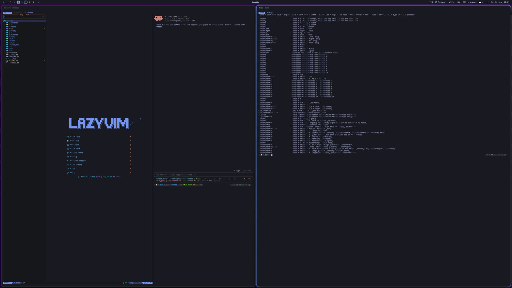
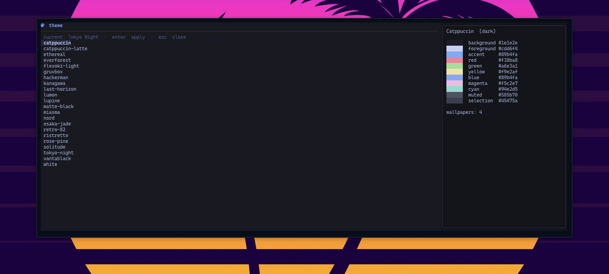

<p align="center">
  
</p>

> **Status: personal fun project, very much in the testing phase.**
> This is my own machine's setup, published as-is. It is not a product, not finished, not
> tested on any Mac but mine (a Mac Studio with two monitors, a Kinesis keyboard, macOS 26 Tahoe),
> and it changes daily. Nothing here is endorsed by or affiliated with Omarchy or Basecamp.
>
> **Read before running `install.sh`:** it rewires your keyboard (Left Command becomes `Super`,
> Caps Lock becomes Command, Escape on tap), takes over window management (AeroSpace), hides the
> macOS menu bar, replaces your tmux, zsh, Ghostty, nvim and git configs (the old ones are moved
> to `~/.config-archive/`, not deleted), installs a dozen brew packages and starts several
> background services. Restoring everything is possible but manual. Read the script, use it for
> ideas, copy what you like into your own dotfiles, and only run it on a machine you are happy to
> reset. No warranty of any kind; see `LICENSE`.

**omacos** brings the look and feel of [Omarchy](https://omarchy.org) to macOS: Hyprland-style
tiling and keybindings on AeroSpace, a Waybar-like bar, Omarchy's menu, themes, tmux and shell
setup, all driven from one `Super` key under your thumb. It is a set of dotfiles, a handful of
scripts and one small native panel.

```sh
# Tested on exactly one Mac (mine). It rewires keys, replaces configs, starts services.
# Read the disclaimer above and install.sh first. Use at your own risk.
git clone https://github.com/H4nYolo/omacos ~/work/projects/omacos
cd ~/work/projects/omacos && ./install.sh
```



A workspace: `ix` opens nvim, Claude Code and a shell in one tmux window, `Super + Enter` adds a
terminal next to it. Windows tile dwindle-style, the focused one glows in the theme's accent, the
bar on top replaces the menu bar.


`Super + Space` opens the launcher: every app, most-used first, `ctrl-x` uninstalls cleanly.
It is a native panel, so it is there before you finish the chord, and the app you were in keeps focus.


`Super + Shift + Space` is Omarchy's menu: capture, clipboard history, emoji, notes, style, toggles,
brew install and remove, updates, system. `Backspace` goes up a level. The tree is one JSON file.



**Style → Theme** switches all of Omarchy's 22 themes at once: terminal, bar, borders, panel, editor,
wallpaper and the macOS appearance. Backgrounds cycle on `Super + Shift + B`, fonts switch live.

## Manual

The details live in [`docs/`](docs/README.md):
[Install](docs/install/README.md) ·
[Keys](docs/keys/README.md) ·
[Desktop](docs/desktop/README.md) ·
[Menu, launcher, panel](docs/menu/README.md) ·
[Style](docs/style/README.md) ·
[Terminal](docs/terminal/README.md)

## Credits

Configuration and the theme palettes under `omacos/.config/omacos/themes/` derived from
[Omarchy](https://github.com/basecamp/omarchy) by Basecamp and the theme authors, MIT licensed.
See `LICENSE`.
