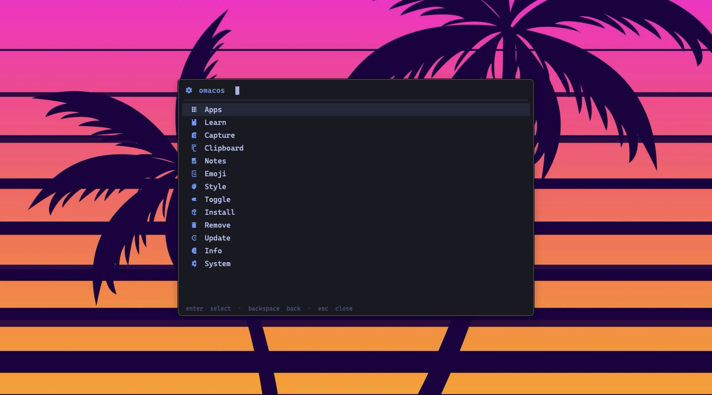
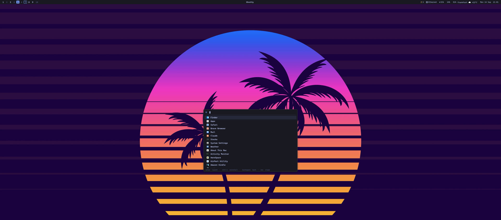

# Menu, launcher, panel and popup

[← Manual](../README.md)

## The panel

`Super + Space` and `Super + Shift + Space` open the **native panel**, `omacos-shell` (`shell/`,
Swift, built by `install.sh`): one resident process that shows a compact floating window centred
on the monitor under the mouse — no process start, app icons from macOS, the app you were in keeps
focus. `Esc` or the same hotkey closes it, another view's hotkey switches in place, `Backspace`
on an empty query goes up a level, a click outside closes. Emoji (`Super + Shift + E`), clipboard
history (`Super + Shift + V`, with a preview column) and the keybindings list (`Super + K`, `Super + Shift + K`
for tmux only) are views of the same panel. Matching works like `fzf --exact`: every word you
type must appear, most-used entries first.

The same views also exist as fzf lists in the popup terminal (`omacos-launcher`, `omacos-menu`,
`omacos-menu-emoji`, `omacos-clipboard`, `omacos-keys`), which the panel opens for anything that
needs a terminal (brew pickers, upgrades, notes, the style pickers) and which keep working over SSH.

## The menu

Omarchy's menu as a tree. `Backspace` on an empty query goes up a level, also out of the pickers;
`Esc` closes. The tree is data: `~/.config/omacos/menu.json` (icon, label, and one of `menu`,
`view`, `popup`, `run`; optional `state` and `when` shell commands for dynamic labels and
visibility). Edit it to add entries; `omacos-menu <route> --list` shows what a level resolves to.

- **Apps** — the launcher below
- **Learn** — keybindings (all / tmux / AeroSpace), the omacos repo, the Omarchy manual, AeroSpace, Ghostty and tmux docs
- **Capture** (`Super + Shift + C`) — screenshot of a region, window or screen (saved to `~/Pictures/Screenshots` and copied),
  screen recording with or without microphone (the entry turns into *Stop* while recording),
  text recognition (OCR) from a selection straight into the clipboard, the clipboard as a QR code, a colour picker that copies hex
- **Clipboard** (`Super + Shift + V`) — history of the last 200 text entries (`omacos-clipboardd`, started by AeroSpace);
  `Enter` pastes into the app that had focus, `ctrl-x` deletes, `alt-c` clears. Password managers' concealed entries are skipped
- **Emoji** (`Super + Shift + E`) — search by name or keyword, `Enter` pastes
- **Notes** (`Super + Shift + N`) — Raycast-Notes-style scratch pad: `~/notes/quick.md` (path in `~/.config/omacos/notes-file`) in nvim,
  cursor under a fresh timestamp in insert mode, every keystroke saved; `Esc` `:q` or just closing the popup keeps everything
- **Style** — theme, background, wallpaper pack and font pickers, see [Style](../style/README.md)
- **Toggle** — screensaver on idle, bar, borders, microphone mute
- **Install** — `omacos-pkg-install`: every Homebrew formula and cask in fzf with `brew info` as preview, `Tab` multi-select,
  `Enter` installs right there. Or the App Store
- **Remove** — `omacos-pkg-remove`: the same for what is installed (`brew leaves` + casks, unused dependencies go too), or an app via Pearcleaner
- **Update** — `brew upgrade`, `brew outdated`, macOS software update
- **Info** — time, weather and network as notifications, About
- **System** — screensaver, lock, sleep, logout, restart, shutdown

The OCR helper is Apple's Vision framework (`~/.config/omacos/ocr.swift`); `install.sh` compiles it once
into `~/.cache/omacos/omacos-ocr`, the capture menu does the same on first use if needed.

## Launcher

The launcher is the Walker look-alike: every app from `/Applications`, `~/Applications` and the
system folders, most-launched first, plus a few actions (screensaver, lock, sleep). `Enter`
launches, `ctrl-x` opens the app in Pearcleaner with its leftovers listed for a clean uninstall,
`Esc` closes. Launch counts live in `~/.local/state/omacos/launcher-history`.

## The popup

Everything that needs a terminal runs in Ghostty's *quick terminal*: a floating panel, centred on the monitor
under the mouse, that AeroSpace never tiles, so it appears in place with no jumps. A second
Ghostty process started by AeroSpace (`omacos-popupd`, config `~/.config/ghostty/popup`) owns
it. `omacos-popup <request>` writes the request to `~/.local/state/omacos/popup-request`
and fires that process's private global hotkey (`ctrl+alt+shift+cmd+F19`, never typed by hand);
`omacos-popup-run` inside the panel then execs the requested script. When it exits, the panel
disappears. A running `brew upgrade` or an open notes pad is never killed, only re-shown.
Ghostty needs Accessibility for the global hotkey.

## Uninstalling apps

Uninstalling is Pearcleaner's job. Pick the app in the launcher with `ctrl-x`, or drag an app to
the Trash: Pearcleaner's Sentinel (enable it in Pearcleaner's settings) pops up and offers to
remove the leftovers. From a script: `/Applications/Pearcleaner.app/Contents/MacOS/Pearcleaner uninstall-all /Applications/Foo.app`.
Pearcleaner turns into that CLI whenever `TERM` is set in its environment, which is why
`install.sh` launches GUI apps with `TERM` and `TMUX` stripped (`omacos-open` does the same).

## Sol

[Sol](https://github.com/ospfranco/sol) stays around on `⌥ Space` as a calculator; drop it from the
Brewfile if you don't need it. Its built-in window management is switched off in `sol/.config/sol/config.json`:
Sol's default `⌃⌥⌘ ←/→` (move window to the next screen) is `Super + ←/→` here, and with both active every
focus change made the window jump.
